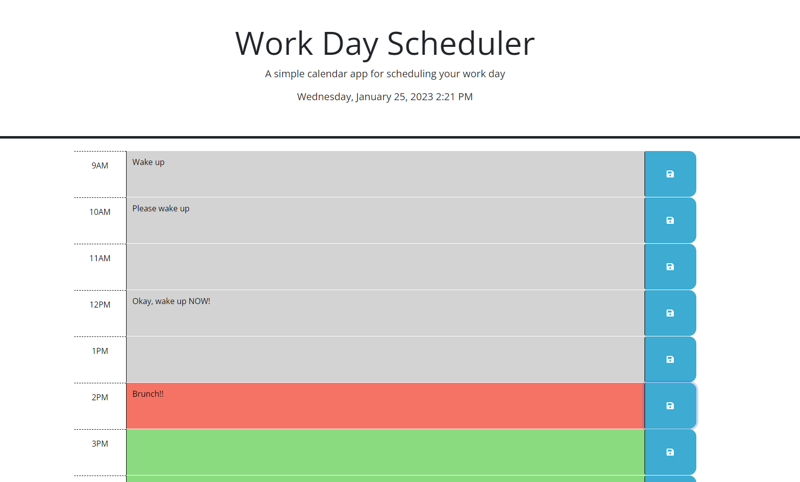
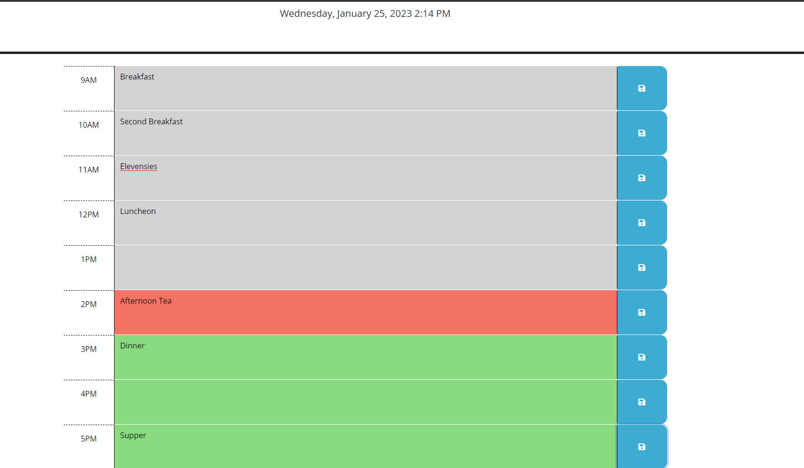

# work-day-scheduler

site link: https://sdoval27.github.io/work-day-scheduler/
repo link: https://github.com/sdoval27/work-day-scheduler

## Description

- Create a site that uses third party API's to log and track a user's schedule throughout the work day.

### Usage:
- When opening the page, the website should appear as so:

- This calendar follows a typical 9am to 5pm work schedule with hourly time blocks that change color as the day progresses. 

- As displayed here, gray blocks represent hours that have already passed, red is the current hour, and green highlights the future hours.

- The use can input their calendar schedule by typing directly into the text area on the calendar, then save their information by clicking the blue save button to the right.

## Installation

N/A

## References

https://day.js.org/docs/en/display/format

 
## License
 
[MIT](https://choosealicense.com/licenses/mit/)

[def]: title-element.png
